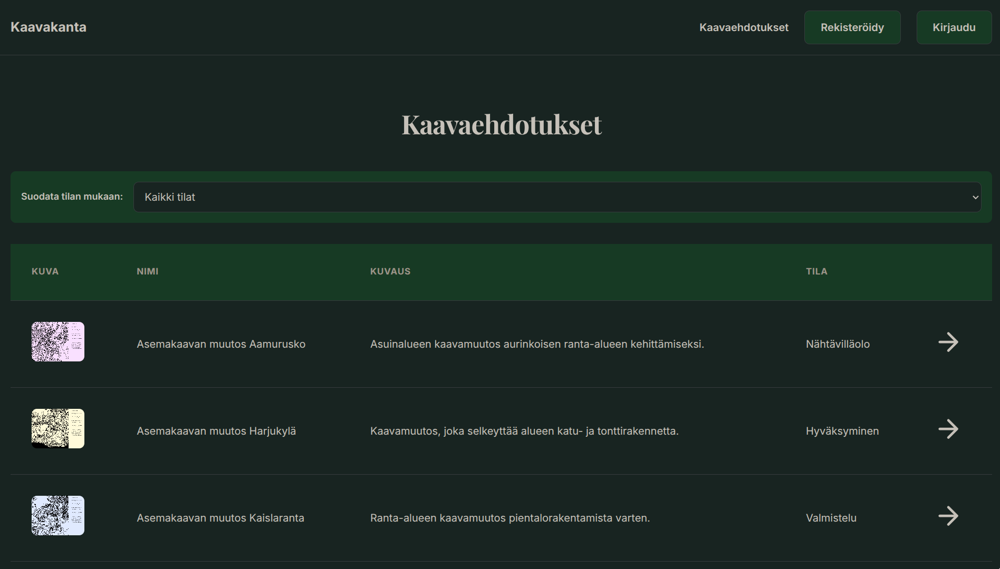

# Kaavakanta - Web-kehitys Semifinaalitehtävä

### Projekti tehtiin Taitaja2026-semifinaalissa, olen jälkeenpäin lisännyt tietokannat lokaalisesti portfoliota varten ja tehnyt UI parannuksia.



## Projektin Kuvaus
Kaavakanta on kunnan verkkopalvelu, jonka kautta kuntalaiset voivat tutustua ajankohtaisiin maankäytön kaavaehdotuksiin ja seurata kaavaprosessin etenemistä.

## Testing:
Vaatii Docker / Docker Compose ja PHP
- Varmista että olet taitaja2026semifinaali hakemistossa
- Aja `docker compose up --build` terminaalissa
- Avaa selain ja mene `localhost:8080`
- Voit nähdä phpMyAdmin:in menemällä `localhost:3000`

---

## ✅ Valmiit Ominaisuudet

### 1. Tietokantayhteys
- ✅ Tietokantayhteys toimii (`config/conn.php`)
- ✅ Merkkisarjatuki suomen kielen erikoismerkeille (UTF-8)
- ✅ Virheenkäsittely yhteysongelmissa

### 2. Käyttäjähallinta
- ✅ **Rekisteröityminen** (`auth/register.php`)
  - Käyttäjän nimen, sähköpostin, osoitteen ja puhelinnumeron tallennus
  - Salasanan hashaus (password_hash)
  - Sähköpostin duplikaattitarkistus
  - Suomenkieliset virheilmoitukset

- ✅ **Kirjautuminen** (`auth/login.php`)
  - Sähköpostilla ja salasanalla kirjautuminen
  - Salasanan varmistus (password_verify)
  - Session hallinta
  - Automaattinen uudelleenohjaus jos jo kirjautunut

- ✅ **Uloskirjautuminen** (`auth/logout.php`)
  - Session tyhjennys
  - Session evästeen poisto
  - Uudelleenohjaus etusivulle

### 3. Navigaatio
- ✅ Responsiivinen navigointipalkki
  - Hamburger-valikko mobiililaitteille
  - Dynaamiset linkit kirjautumistilan mukaan
  - "Terve, [käyttäjän nimi]" -tervehdys kirjautuneille
- ✅ JavaScript-pohjainen valikko (toggle-toiminnallisuus)

### 4. Etusivu (`index.php`)
- ✅ Hero-kuva ja tervetuloteksti
- ✅ Kaavaprosessin selostus
- ✅ Käyttäjän kirjautumistilan näyttö navigaatiossa
- ✅ Responsiivinen grid-asettelu

### 5. Kaavaehdotukset (`plans.php`)
- ✅ **Listausnäkymä**
  - Kaavaehdotusten haku tietokannasta (plans-taulu)
  - Taulukkopohjainen näkymä (kuva, nimi, kuvaus, tila)
  - Sivutus (pagination) - 5 kaavaehdotusta per sivu
  - Tilasuodatus (filter by status)
  - Placeholder-kuva puuttuville kuville

- ✅ **Yksityiskohtainen näkymä**
  - Kaavaehdotuksen kaikki tiedot (nimi, sijainti, pitkä kuvaus, kuva)
  - Kaavaprosessin nykyinen vaihe
  - Tilahistoria (status_history-taulu)
    - Aikajärjestyksessä uusimmasta vanhimpaan
    - Tilan nimi, päivämäärä ja kuvaus
  - "Takaisin kaavaehdotuksiin" -linkki

### 6. Tyylittely (`css/style.css`)
- ✅ Kustomoitu CSS-library (tehty Gemini AI:n avulla)
- ✅ CSS-muuttujat (design tokens) yhtenäiselle ulkoasulle
- ✅ Responsiiviset grid-asettelut (2-sarake, 3-sarake)
- ✅ Taulukon responsiivisuus mobiililaitteille
- ✅ Navigointipalkki ja footer
- ✅ Lomake-elementtien tyylittely
- ✅ Painikkeet ja kortit
- ✅ Playfair Display -fontti otsikoille, Inter body-tekstille

### 7. Responsiivisuus
- ✅ Mobile-first suunnittelu
- ✅ Breakpointit eri näyttökokoja varten
- ✅ Hamburger-valikko pienille näytöille
- ✅ Responsiiviset taulukot (data-label attribuutit)
- ✅ Responsiiviset gridit

---

## ❌ Keskeneräiset Ominaisuudet

### 1. Kommentointitoiminto
- ❌ Kommenttien näyttäminen kaavaehdotuksissa
- ❌ Uuden kommentin lisääminen
- ❌ Kommenttien hallinta (muokkaus/poisto)
- **Status:** Merkitty "Työn alla" -tilaan `plans.php`:ssä (rivi 230)
- **Vaatimukset:**
  - Comments-taulun tietojen haku ja näyttö
  - Kommenttilomake kirjautuneille käyttäjille
  - Kommenttien tallennus tietokantaan
  - Käyttäjän oikeustarkistus (vain omat kommentit muokattavissa)

### 2. Admin-paneeli
- ❌ Kaavaehdotusten hallinta (CRUD-toiminnot)
- ❌ Kaavaehdotusten lisäys/muokkaus/poisto
- ❌ Tilahistorian päivitys
- ❌ Käyttäjähallinta

### 3. Perustelut
   Aika loppui. Olisin muuten tehnyt. Kuitenkin sivun kaikki funktiot toimii jotka kerkesin tehdä.
---

## 🛠️ Teknologiat

- **Backend:** PHP 7.4+
- **Tietokanta:** MySQL/MariaDB
- **Frontend:** HTML5, CSS3 (Custom Library), Vanilla JavaScript
- **Palvelin:** db.taitaja2026.nstrim.app
- **Käyttäjä:** competitor17

---

## 📁 Tiedostorakenne

```
/
├── index.php              # Etusivu
├── plans.php              # Kaavaehdotukset (lista + yksityiskohdat)
├── auth/
│   ├── login.php         # Kirjautuminen
│   ├── register.php      # Rekisteröityminen
│   └── logout.php        # Uloskirjautuminen
├── config/
│   └── conn.php          # Tietokantayhteys
├── css/
│   └── style.css         # Tyylit
├── js/
│   └── scripts.js        # JavaScript (navigaatio)
├── images/               # Kuvat
├── icons/                # Ikonit
└── README.md             # Tämä tiedosto
```

---

## 🤖 AI:n Käyttö Projektissa

Projektissa on käytetty tekoälyä seuraavasti:

1. **Claude Sonnet 4.5:**
   - Kirjautumis- ja rekisteröintitoiminnot
   - Logout-toiminto
   - Kaavaehdotusten tietokannan haku
   - Navbar toggle JavaScript

2. **Google Gemini:**
   - CSS-library suunnittelu ja toteutus
   - Design tokens & responsive grid system

*AI:n avulla tehty koodi on merkitty kommenteilla `/* AI USE: [NIMI] */` ... `/* AI USE END */`*

---

## 📝 Lisätiedot

**Tekijä:** Nikolaos Gavras  
**Organisaatio:** Savon ammattiopisto  
**Kilpailu:** Taitaja2026 - Web-kehitys semifinaalitehtävä  
**Päivämäärä:** 29.1.2026

---

## 🚀 Seuraavat Askeleet

Jotta projekti olisi täysin valmis, seuraavat toimenpiteet tulisi tehdä:

1. **Kommentointitoiminto** - Prioriteetti #1
   - Luo lomake kommenttien lisäämiseen
   - Toteuta kommenttien haku ja näyttö
   - Lisää muokkaus/poisto-toiminnot

2. **Tietoturvaparannukset**
   - Lisää CSRF-suojaus kaikkiin lomakkeisiin
   - Paranna syötteen validointia
   - Toteuta rate limiting kirjautumiselle

3. **Admin-paneeli**
   - Luo admin-käyttäjärooli
   - Toteuta kaavaehdotusten hallinta
   - Lisää käyttäjähallinta

4. **Käytettävyysparannukset**
   - Hakutoiminto kaavaehdotuksille
   - Parempi virheenkäsittely ja käyttäjäpalaute
   - Loading-indikaattorit

---

*README luotu 29.1.2026*
